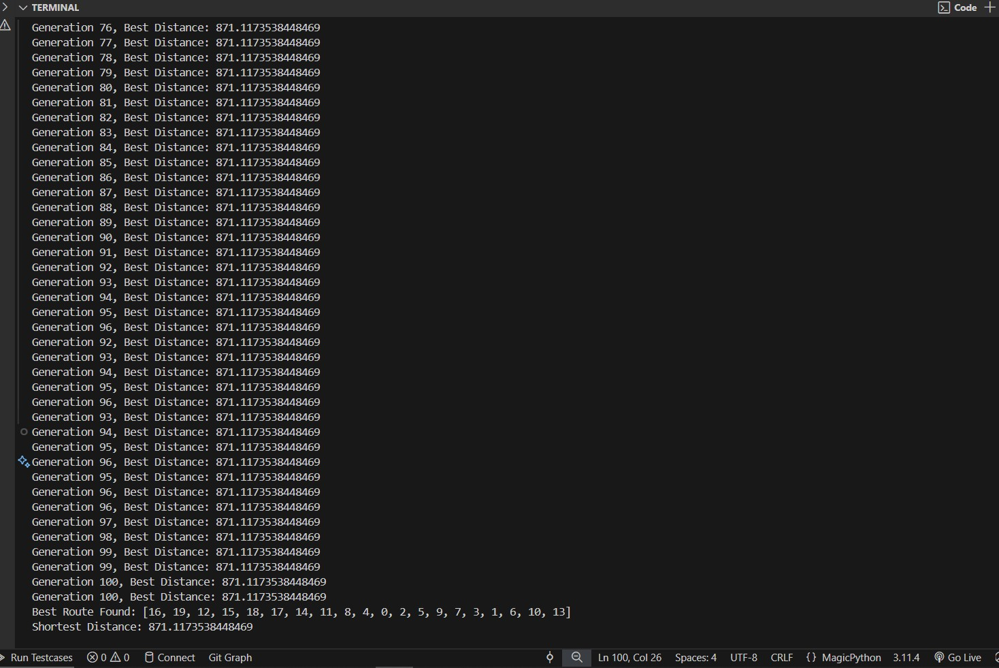

# Traveling Salesperson Problem (TSP) Solved with Genetic Programming

## Introduction
This project demonstrates the application of **Genetic Programming (GP)**, a subset of Evolutionary Algorithms (EAs), to solve the **Traveling Salesperson Problem (TSP)**. GP is an advanced computational technique inspired by natural evolution, designed to automatically generate solutions to complex problems without explicit human intervention. The TSP is a classic optimization problem where the goal is to find the shortest possible route that visits each city exactly once and returns to the starting point.

## Genetic Programming (GP) and Genetic Algorithms (GA)
**Genetic Algorithms (GA)** are population-based search algorithms inspired by natural selection processes. They operate on a population of candidate solutions, applying operators such as selection, crossover, and mutation to evolve better solutions over successive generations. 

**Genetic Programming (GP)** extends GAs by evolving entire programs or models rather than fixed-length strings. In this context, GP evolves routes for the TSP, where each individual in the population represents a potential solution (a permutation of cities). GP differs from traditional GAs in its ability to handle variable-length representations and complex structures, making it particularly suited for problems like the TSP.

## Traveling Salesperson Problem (TSP)
The **Traveling Salesperson Problem (TSP)** is one of the most well-known combinatorial optimization problems. Given a list of cities and the distances between them, the objective is to determine the shortest possible route that visits each city exactly once and returns to the origin city. The TSP is NP-hard, meaning that as the number of cities increases, finding the optimal solution becomes computationally expensive. As a result, heuristic and metaheuristic approaches, such as Genetic Algorithms, are often employed to approximate solutions efficiently.

## Implementation Overview
This implementation uses Python to simulate a Genetic Algorithm for solving the TSP. Below is a breakdown of the key components:

### 1. Initialization
- A population of random routes (permutations of city indices) is generated.
- Each route represents a potential solution to the TSP.

### 2. Fitness Evaluation
- The fitness of each route is calculated based on the total distance traveled.
- A higher fitness score corresponds to a shorter route.

### 3. Selection
- Individuals are selected for reproduction using roulette wheel selection, where the probability of selection is proportional to fitness.

### 4. Crossover
- Two parent routes undergo crossover to produce offspring. The crossover operator ensures that all cities are included exactly once in the offspring.

### 5. Mutation
- A small random change (e.g., swapping two cities) is introduced into the offspring to maintain diversity in the population.

### 6. Replacement
- The new population replaces the old one, and the process repeats for a specified number of generations.

## How to Use This Code
1. **Prerequisites**: Ensure you have Python 3 installed on your system.
2. **Clone the Repository**: Download or clone this repository to your local machine.
3. **Run the Script**: Execute the `main.py` file using the following command:
   ```bash
   python main.py
## Sample Output
 